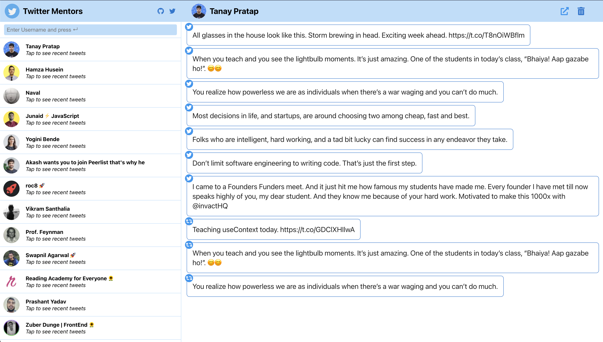

# Twitter Mentors Web

Get access to your Twitter Mentor's/Content Crerator's most recent tweets without searching their profile everytime.

**App Url: https://twitter-mentors-web.netlify.app/**

## Tech Stack

 - React
 - Styling using personal CSS component library [MarvelUI](https://marvel-ui.vercel.app/)
 - Netlify

## Features

- Add any Twitter User by their username
- See most recent Tweets & Re-Tweets (upto 10)
- Click on the Tweet to open in Twitter
- Open user Profile 
- Delete User from local storage
- More to come...

## Preview
